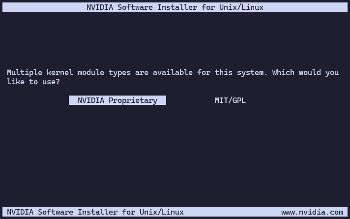
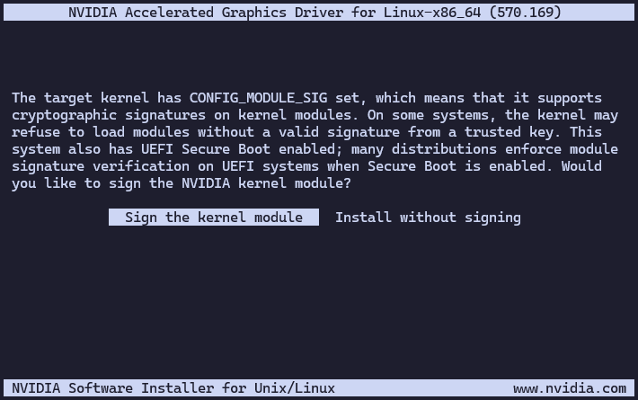
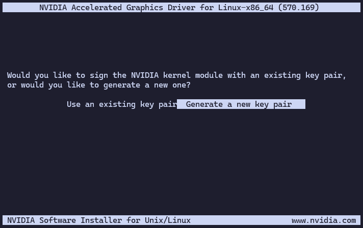
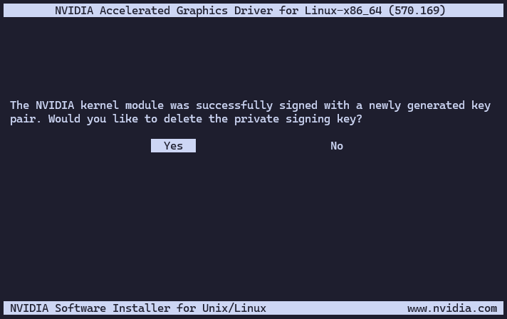
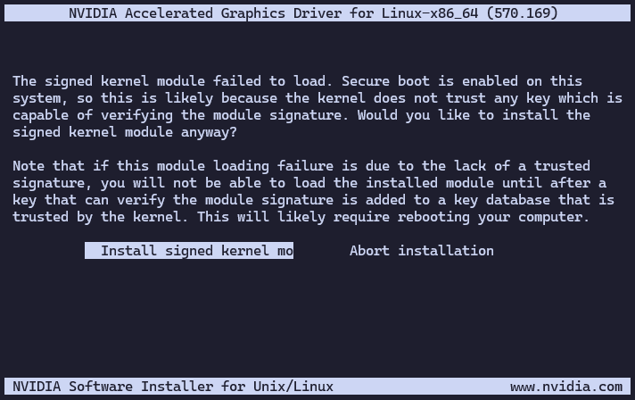
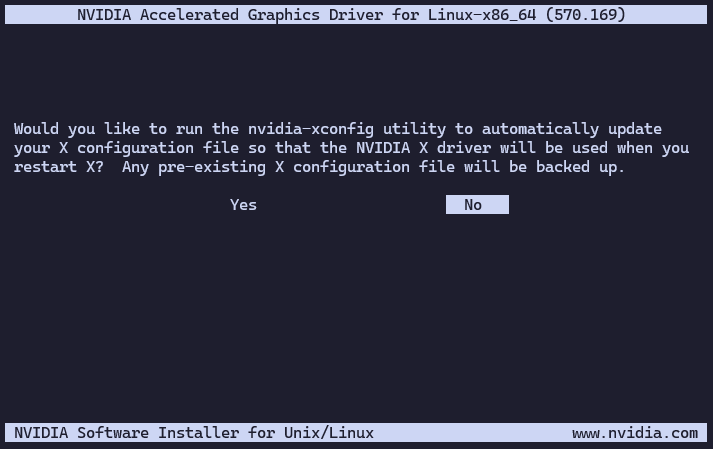

# Install NVIDIA drivers

This guide will take you through the steps of installing NVIDIA (proprietary) drivers on your system.

## What you'll need

To complete this guide, you will need the following:

* A Debian-based system with root access.
* An NVIDIA GPU.
* An internet connection to download the necessary packages.

## Procedure

Follow the steps below to install the NVIDIA drivers:

1. Connect to your Debian-based system as the root user or use `sudo` for administrative privileges.

   ```bash
   user:~$ sudo su -
   ```

1. Get the link to the latest NVIDIA driver from the [NVIDIA Driver Downloads](https://www.nvidia.com/en-us/drivers/)
   page, according to your GPU model and operating system. For example, you might find a link like this:

   ```{note}
   The link will look something like this:
   https://us.download.nvidia.com/XFree86/Linux-x86_64/570.169/NVIDIA-Linux-x86_64-570.169.run 
   ```

1. Download the NVIDIA driver using `wget` or `curl`. Replace the URL with the one you copied in the previous step:

   ```bash
   root:~# wget https://us.download.nvidia.com/XFree86/Linux-x86_64/570.169/NVIDIA-Linux-x86_64-570.169.run
   ```

1. Make the downloaded file executable:

   ```bash
   root:~# chmod +x NVIDIA-Linux-x86_64-570.169.run
   ```

1. Run the installer with root privileges:

   ```bash
   root:~# ./NVIDIA-Linux-x86_64-570.169.run
   ```

1. Follow the on-screen instructions to complete the installation of the proprietary NVIDIA drivers:

   1. Choose the `NVIDIA Proprietary` option when prompted:

      

   1. Choose to sign the kernel module when prompted:

      

   1. Choose to generate a new key pair when prompted:

      

   1. Choose to delete the private signing key, as it is not needed after the module is signed:

      

   1. Take a note of the path to the X.509 certificate on the next screen, as you will need it later. It should look
      something like this:

      ```
      /usr/share/nvidia/nvidia-modsign-crt-793E20FB.der
      ```

   1. Choose to install the signed kernel module when prompted:

      

   1. Choose not to run `nvidia-xconfig` when prompted:

      

1. Add the X.509 certificate you noted earlier to the MOK (Machine Owner Key) list:

   ```bash
   root:~# mokutil --import /usr/share/nvidia/nvidia-modsign-crt-793E20FB.der
   ```

   ```{note}
   Change the path to the X.509 certificate to the one you noted earlier.
   ```

   You will be prompted to create a password for the MOK. Make sure to remember this password, as you will need it
   during the next boot.

1. Reboot your system:

   ```bash
   root:~# reboot
   ```

1. During the boot process, you will be prompted to enroll the MOK. Follow these steps: 

   1. Select "Enroll MOK" from the menu.
   1. Choose "Continue" to proceed.
   1. Enter the password you created earlier when prompted.
   1. Select "Yes" to confirm the enrollment.
   1. Enter the password again to confirm.
   1. Select "Reboot" to complete the process.

1. After rebooting, you can verify that the NVIDIA drivers are installed and working correctly by running:

   ```bash
   root:~# nvidia-smi
   Sun Jun 22 11:33:24 2025
   +-----------------------------------------------------------------------------------------+
   | NVIDIA-SMI 570.169                Driver Version: 570.169        CUDA Version: 12.8     |
   |-----------------------------------------+------------------------+----------------------+
   | GPU  Name                 Persistence-M | Bus-Id          Disp.A | Volatile Uncorr. ECC |
   | Fan  Temp   Perf          Pwr:Usage/Cap |           Memory-Usage | GPU-Util  Compute M. |
   |                                         |                        |               MIG M. |
   |=========================================+========================+======================|
   |   0  NVIDIA GeForce RTX 3060        Off |   00000000:00:05.0 Off |                  N/A |
   |  0%   62C    P0             47W /  170W |       0MiB /  12288MiB |      0%      Default |
   |                                         |                        |                  N/A |
   +-----------------------------------------+------------------------+----------------------+

   +-----------------------------------------------------------------------------------------+
   | Processes:                                                                              |
   |  GPU   GI   CI              PID   Type   Process name                        GPU Memory |
   |        ID   ID                                                               Usage      |
   |=========================================================================================|
   |  No running processes found                                                             |
   +-----------------------------------------------------------------------------------------+
   ```
